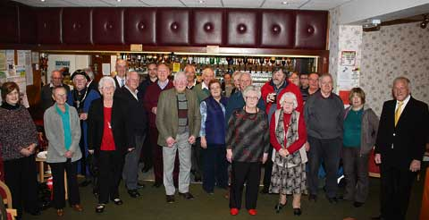
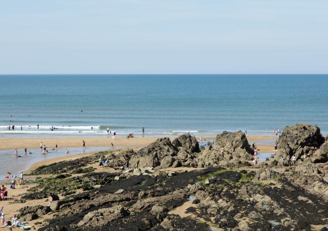
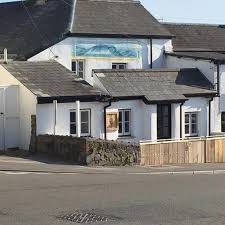
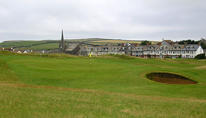
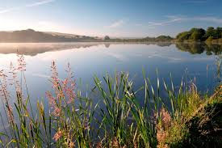

```{r setup, include=FALSE}
knitr::opts_chunk$set(echo = TRUE)
library(ggmap)
library(tidyverse)
```


```{r message=FALSE, warning=FALSE, echo = FALSE}
roadmap <- get_googlemap(center = c(-4.543678, 50.826636), zoom = 14, maptype = "roadmap")
watermap <- get_map(location = c(-4.5413, 50.82435),source="stamen", zoom = 14, maptype = "watercolor")
```

# Road Map in Bude with Locations
## Summerleaze Beach: blue
## Crooklets Beach: green
## Bude Social Club: red
## The Carriers Inn (Pub): purple
## Bude and North Cornwall Golf Club: yellow
## Maeer Lake: black

```{r message=FALSE}
ggmap(roadmap) +
  geom_point(
    aes(x = -4.551312 , y = 50.83074),
    color = "blue", size = 2) +
  geom_point(
    aes(x = -4.553962 , y = 50.83587),
    color = "green", size = 2) +
  geom_point(
    aes(x = -4.545369, y = 50.82959),
    color = "red", size = 2) +
  geom_point(
    aes(x = -2.669208, y =53.24418),
    color = "purple", size = 2)+
  geom_point(
    aes(x = -4.5446, y =50.8326),
    color = "yellow", size = 2)+
  geom_point(
    aes(x = -4.547, y =50.838681),
    color = "black", size = 2)
```


# Watercolor map in Bude with Locations
```{r message=FALSE}
ggmap(watermap) +
  geom_point(
    aes(x = -4.551312 , y = 50.83074),
    color = "blue", size = 2) +
  geom_point(
    aes(x = -4.553962 , y = 50.83587),
    color = "green", size = 2) +
  geom_point(
    aes(x = -4.545369, y = 50.82959),
    color = "red", size = 2) +
  geom_point(
    aes(x = -2.669208, y =53.24418),
    color = "purple", size = 2)+
  geom_point(
    aes(x = -4.5446, y =50.8326),
    color = "yellow", size = 2)+
  geom_point(
    aes(x = -4.547, y =50.838681),
    color = "black", size = 2)
```
 
#### Route from cricket grounds to pub
```{r message=FALSE}
from <- "Bude Social Club"
to <- "The Carriers Inn"
r <- route(from, to, structure = "route")
ggmap(roadmap) + 
  geom_path(aes(x = lon, y = lat), color = "blue", size = 1, data = r, lineend = "round")
ggmap(watermap) + 
  geom_path(aes(x = lon, y = lat), color = "red", size = 1, data = r, lineend = "round")
```


#Images












